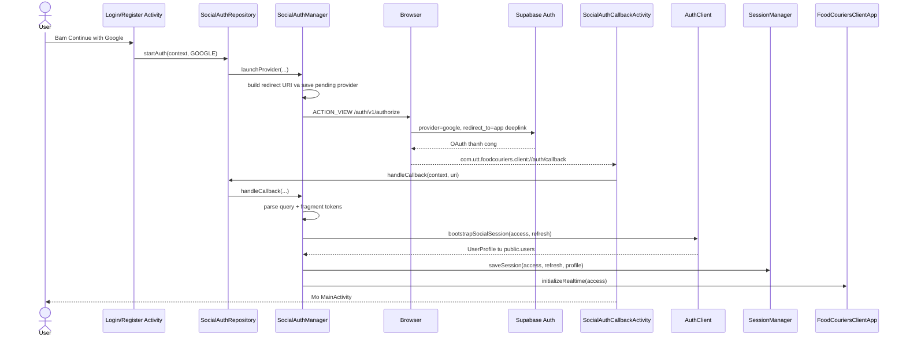
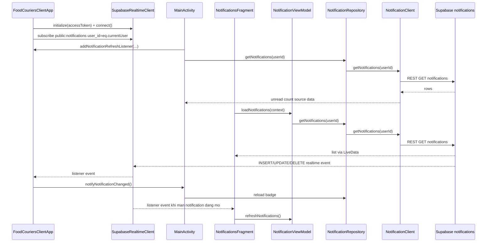
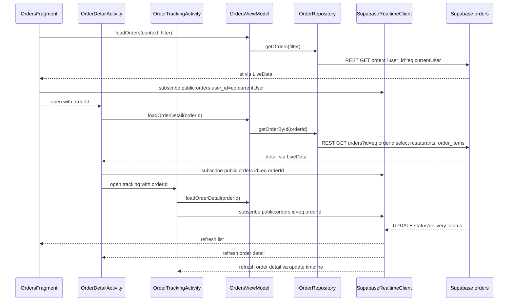

# Auth, Notification va Realtime Flow

Tai lieu nay tom tat cac luong chay chinh trong client Android: dang nhap Google qua Supabase OAuth, notification in-app, va order realtime. Muc tieu la doc nhanh de nam duoc man hinh nao goi lop nao, du lieu di dau, va vi sao realtime event van reload lai bang REST.

## 1. Google Login Qua Supabase OAuth

Ghi nho:

- App khong dung Google Sign-In SDK truc tiep. Supabase Auth va browser xu ly OAuth.
- Callback co the tra token trong fragment sau dau `#`, nen parser phai doc ca query va fragment.
- Token OAuth moi la Supabase Auth session. App van phai bootstrap profile nghiep vu trong `public.users`.
- Realtime chi duoc khoi tao sau khi session chinh duoc luu thanh cong.

## 2. Notification In-App Va Realtime

Ghi nho:

- Co hai subscription notification:
  - `FoodCouriersClientApp`: subscription toan app de hien toast va refresh badge.
  - `NotificationsFragment`: subscription cuc bo khi dang mo danh sach, dung de reload list.
- Khi user mark read/delete, ViewModel goi REST qua repository/client, sau do reload state.
- Realtime event khong render truc tiep item moi; no chi kich hoat reload REST de UI dong bo voi backend/RLS.

## 3. Order Realtime Va Tracking

Ghi nho:

- `OrdersFragment` subscribe theo `user_id` vi no quan tam moi don cua user trong danh sach.
- `OrderDetailActivity` va `OrderTrackingActivity` subscribe theo `id` vi chi quan tam mot don dang mo.
- Payload realtime tu Supabase co the khong du `restaurants` va `order_items`, nen UI luon goi lai `OrderRepository#getOrderById`.
- Timeline dung thu tu `OrderStatus` de xac dinh buoc nao da dat.

## 4. Vi Tri Cac Lop Chinh

| Luong | Lop chinh | Vai tro |
| --- | --- | --- |
| Google OAuth | `LoginActivity`, `RegisterActivity` | Diem user bam provider |
| Google OAuth | `SocialAuthRepository` | Lop trung gian cho UI |
| Google OAuth | `SocialAuthManager` | Build authorize URL, parse callback, bootstrap session |
| Google OAuth | `SocialAuthCallbackActivity` | Nhan deep link va dieu huong ket qua |
| Notification | `FoodCouriersClientApp` | Subscribe notification toan app, refresh badge/toast |
| Notification | `NotificationsFragment` | Danh sach notification va subscription cuc bo |
| Notification | `NotificationViewModel` | State list, unread count, success action |
| Notification | `NotificationRepository`, `NotificationClient` | REST read/update/delete notifications |
| Order | `OrdersFragment` | Danh sach orders va realtime theo user |
| Order | `OrderDetailActivity` | Chi tiet order va realtime theo order id |
| Order | `OrderTrackingActivity` | Timeline tracking va realtime theo order id |
| Order | `OrderRepository` | REST/RPC tao, doc, validate promotion, parse order |
| Realtime | `SupabaseRealtimeClient` | WebSocket, heartbeat, reconnect, subscribe/unsubscribe |
| Realtime | `RealtimeChannel`, `RealtimeListener` | Quan ly listener va callback INSERT/UPDATE/DELETE |
