# Cart, OAuth Login, Payment - Study Guide

Tai lieu nay tong hop luong hoat dong thuc te trong app `FoodCouriers-Client` de on van dap va trinh bay. Noi dung bam theo code hien tai, tap trung vao 3 module:

1. Cart
2. Login voi OAuth2 Google qua Supabase
3. Checkout va Payment VNPAY

## 1. Kien truc chung cua client

App client la Android Java, di theo huong MVVM:

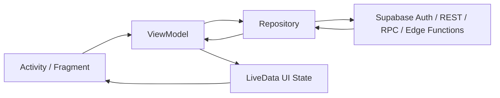

### 1.1 Cac lop nen tang

| Lop | Vai tro |
| --- | --- |
| `SupabaseConfig` | Chua URL, anon key, endpoint Auth/REST/Storage/Realtime, header constants |
| `SessionManager` | Luu session chinh cua app trong SharedPreferences |
| `BaseSupabaseClient` | Base client cho AuthClient: OkHttp, Gson, main-thread callback |
| `RepositoryCallback<T>` | Callback chung giua Repository va ViewModel/UI |
| `BaseViewModel` | Quan ly loading, error, success message bang LiveData |
| `BaseActivity`, `BaseFragment` | Cac helper UI chung nhu toolbar, banner, snackbar |

### 1.2 Supabase config

File: `app/src/main/java/com/utt/foodcouriers_client/data/remote/SupabaseConfig.java`

Gia tri chinh:

```java
public static final String SUPABASE_URL = BuildConfig.SUPABASE_URL;
public static final String SUPABASE_ANON_KEY = BuildConfig.SUPABASE_ANON_KEY;

public static final String AUTH_URL = SUPABASE_URL + "/auth/v1";
public static final String REST_URL = SUPABASE_URL + "/rest/v1";
public static final String STORAGE_URL = SUPABASE_URL + "/storage/v1";
```

Khi goi Supabase REST/RPC, request thuong co:

```text
apikey: <SUPABASE_ANON_KEY>
Authorization: Bearer <access_token>
Content-Type: application/json
```

### 1.3 SessionManager

File: `app/src/main/java/com/utt/foodcouriers_client/utils/SessionManager.java`

`SessionManager` luu cac gia tri quan trong:

| Key | Y nghia |
| --- | --- |
| `access_token` | JWT access token cua Supabase Auth |
| `refresh_token` | Token dung de refresh session |
| `user_id` | ID trong bang nghiep vu `public.users` |
| `auth_user_id` | ID trong `auth.users`, lay tu JWT `sub` |
| `user_email`, `user_name`, `user_phone`, `user_avatar`, `user_role` | Thong tin profile app |
| `cart_id` | Cache cart hien tai de tranh query lai nhieu lan |
| `pending_payment_order_id` | Order dang cho callback VNPAY |

Luu y rat quan trong:

- `auth.users.id` la user cua Supabase Auth.
- `public.users.id` la user nghiep vu cua app.
- Cart va order hien dung `public.users.id`.
- OAuth tra ve `auth.users.id`, nen app phai bootstrap sang `public.users`.

## 2. Module Cart

### 2.1 Muc tieu nghiep vu

Cart la gio hang tam thoi cua user:

- User phai dang nhap moi duoc add cart.
- Moi user co mot cart active.
- Mot cart co the chua mon tu nhieu restaurant.
- Man cart group item theo restaurant.
- Khi checkout, cac item duoc chon se tao order theo tung restaurant.
- Cart khong phai lich su mua hang. Lich su nam o `orders` va `order_items`.

### 2.2 Cac class tham gia

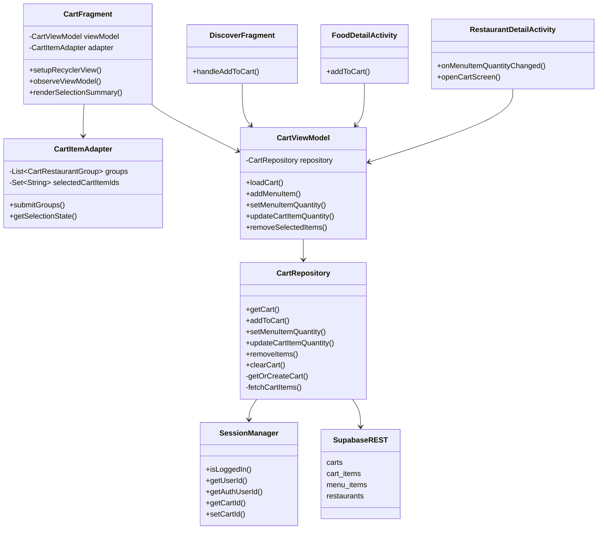

### 2.3 Bang database lien quan

#### `carts`

Ban dau schema co `restaurant_id`, sau migration `005_multi_restaurant_cart.sql` da bo cot nay.

Y nghia hien tai:

```text
carts
- id
- user_id        -> public.users.id
- user_auth_id  -> auth.users.id, neu migration hien tai co dung
- updated_at
```

Mot user co mot cart active. Cart khong gan truc tiep voi restaurant nua.

#### `cart_items`

```text
cart_items
- id
- cart_id       -> carts.id
- menu_item_id  -> menu_items.id
- quantity
- note
- created_at
- UNIQUE(cart_id, menu_item_id)
```

Diem can nho:

- Unique hien tai theo `(cart_id, menu_item_id)`.
- Neu cung mot mon nhung note khac nhau thi van bi gop vao mot dong.
- Neu muon ho tro variant/note khac nhau, can doi unique key, vi du `(cart_id, menu_item_id, variant_key)`.

### 2.4 Luong add to cart

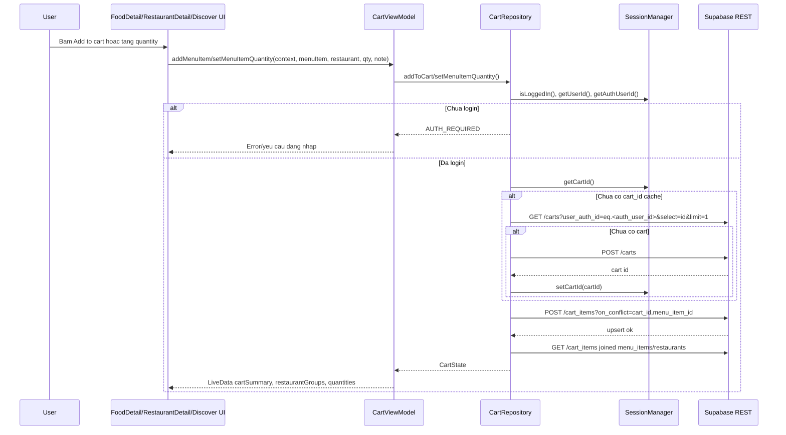

### 2.5 Query Supabase trong cart

#### Tim cart hien tai

Neu co `cart_id` cache:

```text
GET /rest/v1/carts?id=eq.<cart_id>&select=id&limit=1
```

Neu khong co cache, tim theo user:

```text
GET /rest/v1/carts?user_auth_id=eq.<auth_user_id>&select=id&limit=1
```

Neu chua co cart:

```text
POST /rest/v1/carts
Prefer: return=representation
```

Payload:

```json
{
  "user_id": "public.users.id",
  "user_auth_id": "auth.users.id"
}
```

#### Upsert item

```text
POST /rest/v1/cart_items?on_conflict=cart_id,menu_item_id
Prefer: resolution=merge-duplicates,return=representation
```

Payload:

```json
{
  "cart_id": "...",
  "menu_item_id": "...",
  "quantity": 2,
  "note": "it cay"
}
```

#### Update quantity

```text
PATCH /rest/v1/cart_items?id=eq.<cart_item_id>
```

Payload:

```json
{
  "quantity": 3
}
```

#### Remove selected items

```text
DELETE /rest/v1/cart_items?id=in.(id1,id2,id3)
```

#### Fetch cart items va group theo restaurant

```text
GET /rest/v1/cart_items
  ?cart_id=eq.<cart_id>
  &select=id,quantity,note,
    menu_items(
      id,
      restaurant_id,
      name,
      price,
      image_url,
      restaurants(
        id,
        name,
        delivery_fee,
        latitude,
        longitude
      )
    )
  &order=id
```

Sau khi co response:

1. Parse tung `cart_items`.
2. Tao `CartItem`.
3. Tao `MenuItem` ben trong `CartItem`.
4. Lay nested `restaurants`.
5. Dung `restaurant_id` lam key de group.
6. Tinh `subtotal = sum(price * quantity)`.
7. Tinh `deliveryFee = sum(delivery_fee cua moi restaurant co item)`.
8. Tao `CartState`.

### 2.6 Bind data len UI cart

`CartViewModel` co cac LiveData:

| LiveData | Noi dung |
| --- | --- |
| `cartItems` | Danh sach item phang |
| `restaurantGroups` | Danh sach group theo restaurant |
| `cartSummary` | Tong item, subtotal, delivery fee, total |
| `menuItemQuantities` | Map `menu_item_id -> quantity`, dung de hien quantity tren restaurant detail |
| `emptyState` | Cart rong hay khong |
| `loading`, `errorMessage`, `successMessage` | Trang thai UI chung tu BaseViewModel |

`CartFragment.observeViewModel()` bind:

- `restaurantGroups` -> `adapter.submitGroups(groups)`
- `cartSummary` -> text subtotal, delivery, total, cart count
- `emptyState` -> an/hien content hoac empty state
- `successMessage` -> ToastBanner

`CartItemAdapter`:

- Hien moi restaurant la mot group section.
- Trong group co cac item view.
- Co checkbox chon nha hang.
- Co checkbox chon tung item.
- Co nut tang/giam quantity.
- Tu tinh `SelectionState`:
  - selected item ids
  - selected item count
  - selected restaurant count
  - subtotal
  - delivery fee
  - total

### 2.7 Luong cart sang checkout

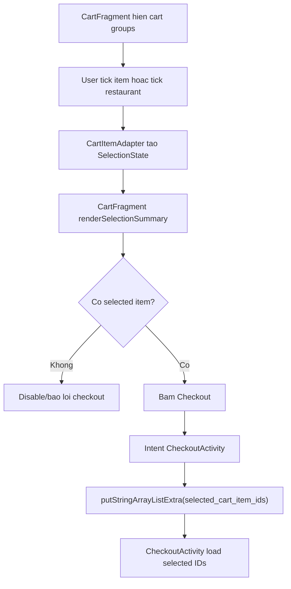

### 2.8 Diem can luu y khi van dap cart

1. Cart la temporary data, order la historical data.
2. Mot cart co the co nhieu restaurant, nen UI group theo restaurant.
3. Client dung Supabase REST truc tiep, khong qua backend rieng cho cart.
4. RLS yeu cau token hop le, nen phai login.
5. `cart_id` duoc cache trong `SessionManager`, nhung van verify lai khi load.
6. Khi item quantity ve 0 thi repository xoa item.
7. Hien tai `clearCartAfterOrderSuccess()` clear toan bo cart, day la diem can cai tien neu checkout chi chon mot phan item.

## 3. Login OAuth2 Google

### 3.1 Muc tieu nghiep vu

Login OAuth2 giup user dang nhap bang Google thong qua Supabase Auth.

Trang thai hien tai:

- Google OAuth da co flow hoan chinh.
- Facebook moi la stub, chua tich hop that.
- App khong dung Google Sign-In SDK truc tiep.
- App mo browser den Supabase `/auth/v1/authorize`.
- Callback ve app bang deep link.
- App parse token va bootstrap profile.

### 3.2 Cac class tham gia

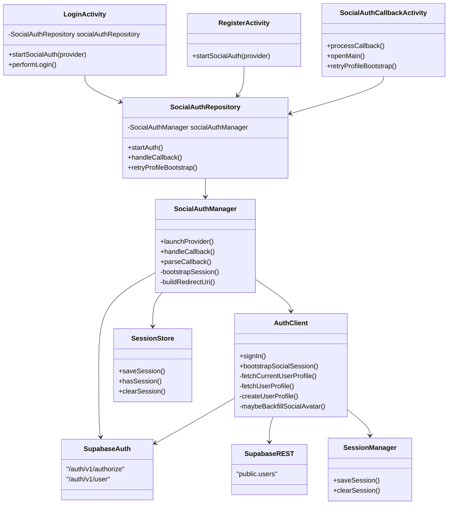

### 3.3 Deep link config

File: `app/src/main/AndroidManifest.xml`

```xml
<activity
    android:name=".ui.auth.SocialAuthCallbackActivity"
    android:exported="true"
    android:launchMode="singleTask">
    <intent-filter>
        <action android:name="android.intent.action.VIEW" />
        <category android:name="android.intent.category.DEFAULT" />
        <category android:name="android.intent.category.BROWSABLE" />
        <data
            android:host="auth"
            android:pathPrefix="/callback"
            android:scheme="com.utt.foodcouriers.client" />
    </intent-filter>
</activity>
```

Deep link day du:

```text
com.utt.foodcouriers.client://auth/callback
```

### 3.4 Flow OAuth Google

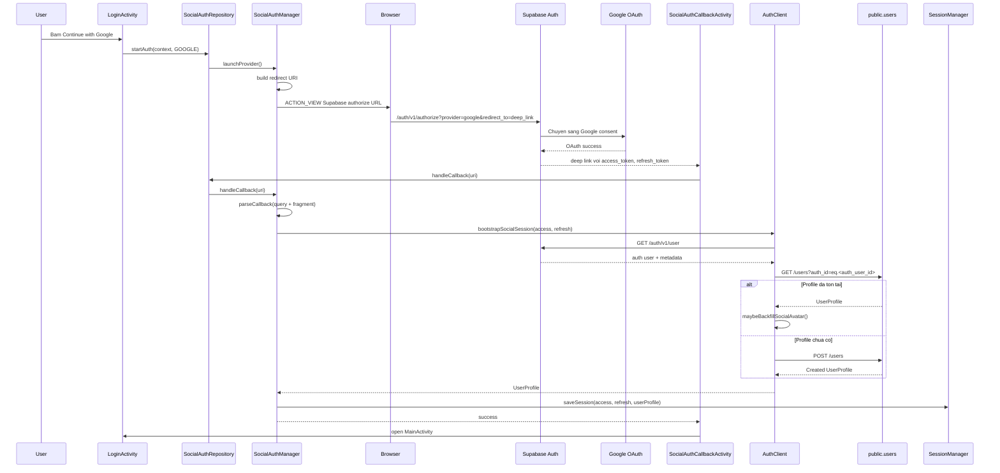

### 3.5 URL OAuth duoc build nhu the nao

Trong `SocialAuthManager.launchProvider()`:

```text
<SUPABASE_URL>/auth/v1/authorize
  ?provider=google
  &redirect_to=com.utt.foodcouriers.client://auth/callback
```

Vi du:

```text
https://xxxx.supabase.co/auth/v1/authorize?provider=google&redirect_to=com.utt.foodcouriers.client%3A%2F%2Fauth%2Fcallback
```

### 3.6 Parse callback

Supabase co the tra token trong fragment:

```text
com.utt.foodcouriers.client://auth/callback#access_token=...&refresh_token=...&expires_in=3600
```

Vi vay `SocialAuthManager.parseCallback()` doc ca:

- `uri.getQuery()`
- `uri.getFragment()`

Ket qua parse thanh `SocialAuthResult`:

| Field | Y nghia |
| --- | --- |
| `provider` | Google/Facebook |
| `accessToken` | JWT access token |
| `refreshToken` | refresh token |
| `errorCode` | Ma loi neu OAuth fail |
| `errorDescription` | Mo ta loi |
| `rawUri` | Deep link goc |
| `expiresInSeconds` | Thoi gian song token |

### 3.7 Bootstrap profile

Sau OAuth, token moi chi xac thuc Supabase Auth. App van can profile nghiep vu:

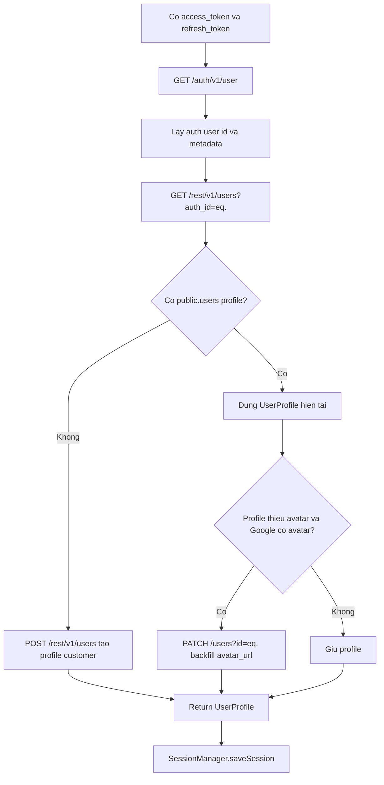

### 3.8 Email/password login so voi OAuth

Email/password login:

```text
POST /auth/v1/token?grant_type=password
```

Payload:

```json
{
  "email": "...",
  "password": "..."
}
```

Sau do:

1. Nhan `access_token`, `refresh_token`, `user.id`.
2. `AuthClient.fetchUserProfile(auth_user_id)`.
3. Luu session vao `SessionManager`.

OAuth login:

1. Mo browser `/auth/v1/authorize`.
2. Nhan deep link callback.
3. Parse token.
4. Goi `/auth/v1/user`.
5. Fetch/create `public.users`.
6. Luu session.

### 3.9 Cau hinh Supabase OAuth can co

Trong Supabase Dashboard:

1. Authentication -> Providers -> Google: bat Google provider.
2. Google Cloud Console OAuth callback:

```text
https://<project-ref>.supabase.co/auth/v1/callback
```

3. Supabase Redirect URLs phai include:

```text
com.utt.foodcouriers.client://auth/callback
```

4. `public.users` phai co RLS cho phep user tao/doc/sua profile cua chinh minh theo `auth.uid()`.

### 3.10 Diem can luu y khi van dap OAuth

1. App khong giu Google client secret.
2. Supabase Auth xu ly OAuth state va giao tiep voi Google.
3. App chi mo authorize URL va nhan callback.
4. Callback token co the nam trong URL fragment, nen parser phai doc fragment.
5. `public.users` la profile nghiep vu, khac `auth.users`.
6. Account co `is_active = false` thi app reject va clear session.
7. Facebook hien moi la stub, chua tich hop provider that.

## 4. Checkout va Payment

### 4.1 Muc tieu nghiep vu

Checkout bien cart items thanh order:

- User chon item trong cart.
- Checkout tinh subtotal, delivery fee, discount.
- Neu cart co item tu nhieu restaurant, tao nhieu order rieng.
- COD: tao order xong la thanh cong.
- VNPAY: tao order xong thi tao payment transaction va mo payment URL.

### 4.2 Cac class tham gia

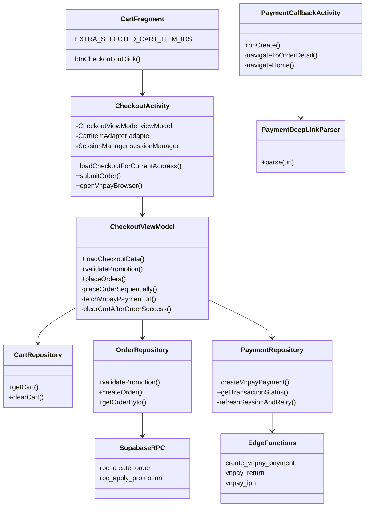

### 4.3 Luong checkout data

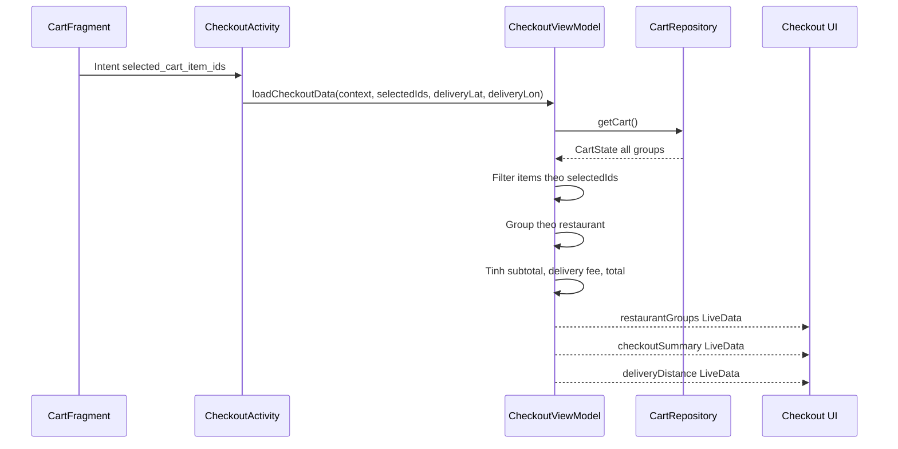

`CheckoutViewModel.loadCheckoutData()`:

1. Goi `CartRepository.getCart()`.
2. Duyet qua tung `CartRestaurantGroup`.
3. Chi giu item co id nam trong `selectedIds`.
4. Tinh:
   - `subtotal = price * quantity`
   - `itemCount`
   - `deliveryFee`
   - `distance`
5. Publish `restaurantGroups`, `checkoutSummary`, `deliveryDistance`.

### 4.4 Tinh phi giao hang

Trong checkout:

- Restaurant co `latitude`, `longitude`.
- Address user co `latitude`, `longitude`.
- Dung `DistanceUtils.calculateDistanceKm(...)`.
- `calculatedDeliveryFee = distanceKm * pricePerKm`.
- `pricePerKm` hien lay tu `group.getDeliveryFee()`.

Neu khong co toa do hop le thi phi giao hang tinh ra 0 cho phan calculated fee.

### 4.5 Luong place order COD

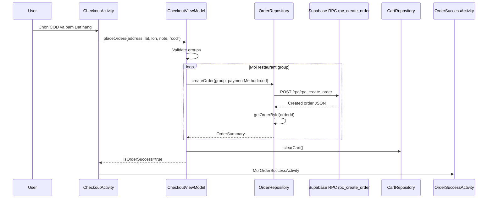

### 4.6 RPC `rpc_create_order`

File: `supabase/migrations/011_add_delivery_fee_to_rpc.sql`

Input:

```sql
rpc_create_order(
    p_user_id UUID,
    p_restaurant_id UUID,
    p_delivery_address TEXT,
    p_delivery_latitude DOUBLE PRECISION,
    p_delivery_longitude DOUBLE PRECISION,
    p_note TEXT,
    p_payment_method TEXT,
    p_promotion_code TEXT,
    p_items JSONB,
    p_delivery_fee INTEGER DEFAULT 0
)
```

Payload tu Android:

```json
{
  "p_user_id": "public.users.id",
  "p_restaurant_id": "restaurant id",
  "p_delivery_address": "dia chi giao hang",
  "p_delivery_latitude": 10.123,
  "p_delivery_longitude": 106.123,
  "p_note": "ghi chu",
  "p_payment_method": "cod",
  "p_promotion_code": "SALE10",
  "p_items": [
    {
      "menu_item_id": "...",
      "quantity": 2,
      "note": "it cay"
    }
  ],
  "p_delivery_fee": 20000
}
```

RPC lam gi:

1. Validate restaurant ton tai, active, open.
2. Validate menu item con available.
3. Server tinh lai subtotal bang gia trong `menu_items`.
4. Apply promotion neu co.
5. Tinh `total = subtotal + delivery_fee - discount`.
6. Generate `order_code`.
7. Insert vao `orders`.
8. Insert vao `order_items` theo snapshot:
   - `menu_item_name`
   - `menu_item_price`
   - `quantity`
   - `subtotal`
   - `note`
9. Insert `order_status_logs`.
10. Update promotion usage.
11. Return JSON order vua tao.

Tai sao phai tinh gia o server:

- Client khong dang tin tuyet doi.
- Gia mon co the bi sua.
- Tranh user modify payload de giam gia.

### 4.7 Bang order/payment lien quan

#### `orders`

Cot quan trong:

```text
orders
- id
- order_code
- user_id              -> public.users.id
- restaurant_id
- delivery_address
- delivery_latitude
- delivery_longitude
- subtotal
- delivery_fee
- discount
- total
- payment_method       -> cod | vnpay
- payment_status       -> pending | paid | failed | refunded
- status               -> pending | confirmed | preparing | delivering | delivered | cancelled
- delivery_status
```

#### `order_items`

Dung de luu snapshot mon tai thoi diem dat hang:

```text
order_items
- order_id
- menu_item_id
- menu_item_name
- menu_item_price
- quantity
- subtotal
- note
```

Ly do co snapshot:

- Sau nay admin co the doi ten/gia mon.
- Lich su don hang cua user van phai hien dung du lieu luc dat.

#### `payment_transactions`

Dung lam audit trail giao dich gateway:

```text
payment_transactions
- id
- order_id
- provider
- provider_order_ref
- gateway_transaction_no
- gateway_response_code
- bank_code
- amount
- status              -> pending | success | failed
- pay_url
- expires_at
- paid_at
- idempotency_key
- failure_reason
- return_payload
- ipn_payload
- created_at
- updated_at
```

### 4.8 COD va VNPAY khac nhau o dau

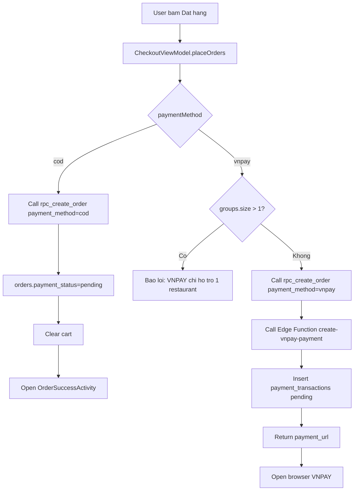

Diem can nho:

- COD khong can gateway, chi can order pending.
- VNPAY can tao transaction rieng.
- VNPAY chi cho mot restaurant group trong phase hien tai.

### 4.9 VNPAY payment flow

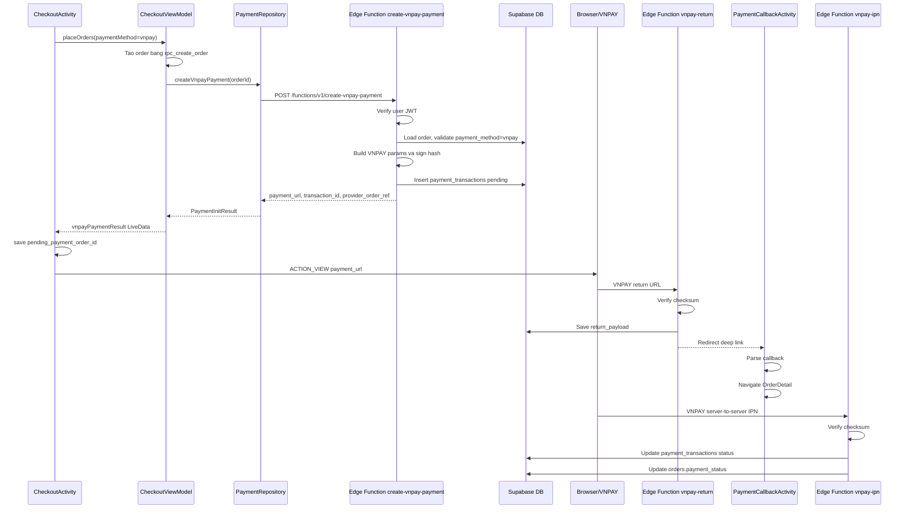

### 4.10 `create-vnpay-payment`

File: `supabase/functions/create-vnpay-payment/index.ts`

Request tu Android:

```text
POST <SUPABASE_URL>/functions/v1/create-vnpay-payment
Authorization: Bearer <access_token>
apikey: <anon_key>
Idempotency-Key: <orderId-timestamp>
```

Payload:

```json
{
  "order_id": "...",
  "idempotency_key": "..."
}
```

Edge Function lam gi:

1. Kiem tra co Authorization header.
2. Dung anon key + user JWT de `auth.getUser()`.
3. Dung service role client cho DB operations.
4. Tim order theo `order_id`.
5. Check:
   - order ton tai
   - payment_method phai la `vnpay`
   - order chua paid
   - order chua cancelled
6. Neu co transaction pending chua het han thi return lai transaction cu.
7. Neu idempotency key da co thi return lai transaction cu.
8. Tao `provider_order_ref`.
9. Build params VNPAY:
   - `vnp_Amount`
   - `vnp_TxnRef`
   - `vnp_ReturnUrl`
   - `vnp_CreateDate`
   - `vnp_ExpireDate`
10. Ky secure hash bang secret server-side.
11. Insert `payment_transactions` status `pending`.
12. Return `payment_url`.

Diem bao mat:

- Client khong duoc tu ky VNPAY hash.
- Secret VNPAY nam trong Edge Function environment.
- Service role chi dung trong Edge Function server-side.

### 4.11 Payment callback ve app

Deep link payment:

```text
com.utt.foodcouriers.client://payment/vnpay/callback
```

Manifest:

```xml
<activity
    android:name=".ui.payment.PaymentCallbackActivity"
    android:exported="true"
    android:launchMode="singleTask">
    <intent-filter>
        <action android:name="android.intent.action.VIEW" />
        <category android:name="android.intent.category.DEFAULT" />
        <category android:name="android.intent.category.BROWSABLE" />
        <data
            android:scheme="com.utt.foodcouriers.client"
            android:host="payment"
            android:pathPrefix="/vnpay/callback" />
    </intent-filter>
</activity>
```

`vnpay-return` redirect ve:

```text
com.utt.foodcouriers.client://payment/vnpay/callback
  ?txn_ref=<provider_order_ref>
  &result=success|failed
  &response_code=<code>
  &transaction_no=<gateway_txn_no>
  &amount=<amount>
  &checksum_valid=true|false
```

`PaymentDeepLinkParser` parse thanh `PaymentCallbackResult`.

`PaymentCallbackResult.isSuccess()` chi true khi:

```text
checksum_valid == true
result == "success"
```

`PaymentCallbackActivity`:

1. Lay `Uri` tu intent.
2. Parse callback.
3. Lay `pending_payment_order_id` tu `SessionManager`.
4. Hien success/warning banner theo callback.
5. Neu co order id thi mo `OrderDetailActivity`.
6. Neu khong co order id thi ve `MainActivity`.

### 4.12 Return callback va IPN khac nhau

| Thanh phan | Muc dich | Co phai source of truth? |
| --- | --- | --- |
| `vnpay-return` | Dua user tu browser ve app, phuc vu UX | Khong |
| `PaymentCallbackActivity` | Parse callback va dieu huong den order detail | Khong |
| `vnpay-ipn` | Server-to-server callback tu VNPAY | Co |

Ly do IPN la source of truth:

- Return callback di qua browser/user, co the bi mat, bi dong app, bi retry.
- IPN la giao tiep server-to-server.
- IPN verify checksum va update DB.

### 4.13 State machine can phan biet

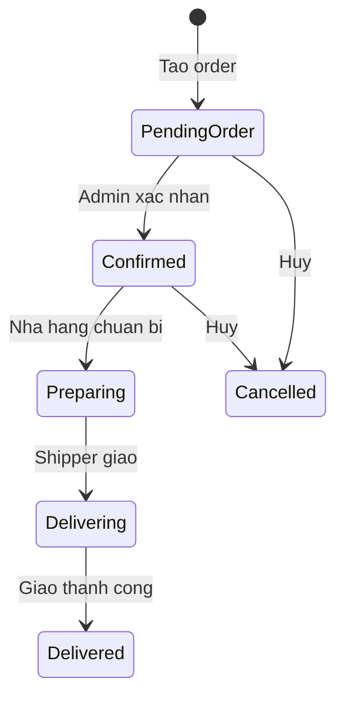

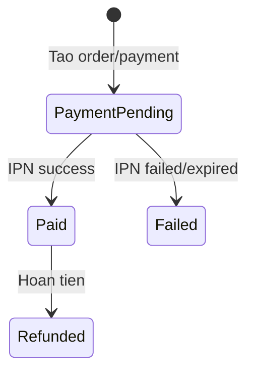

Can noi ro:

- `orders.status` la trang thai van hanh don hang.
- `orders.payment_status` la trang thai thanh toan.
- Khong nen dung `payment_status` de thay the `status`.

### 4.14 Diem can luu y khi van dap payment

1. Client tao order truoc, sau do moi tao payment URL.
2. VNPAY chi ho tro 1 restaurant group o phase hien tai.
3. Edge Function dung JWT de verify user, service role de thao tac DB.
4. VNPAY secret khong nam trong app.
5. `payment_transactions` la audit trail, khong phai thay the `orders`.
6. Return callback chi giup UX, IPN moi cap nhat payment chuan.
7. Sau callback, app nen doc lai order/payment status tu server de hien thi dung trang thai moi nhat.
8. Can can than mismatch `auth.users.id` va `public.users.id` khi query order trong Edge Function.

## 5. Cac flow tong hop de trinh bay nhanh

### 5.1 Tong quan tu login den cart den payment

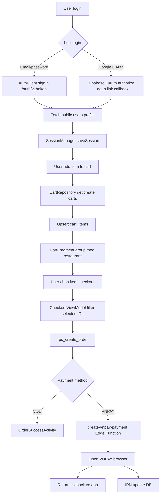

### 5.2 Data ownership

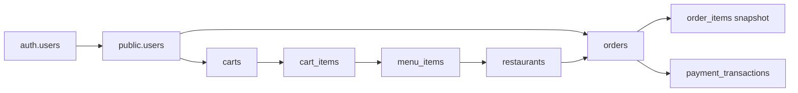

## 6. Bo cau hoi van dap theo module

### 6.1 Cau hoi module Cart

#### Cau 1: Cart trong app duoc luu local hay remote?

Tra loi:

Cart hien duoc luu remote tren Supabase qua hai bang `carts` va `cart_items`. Client goi Supabase REST bang `CartRepository`. `SessionManager` chi cache `cart_id`, khong phai source of truth.

#### Cau 2: Vi sao user phai login moi add cart?

Tra loi:

Vi cart gan voi user, can `access_token` de Supabase RLS biet user nao dang thao tac. Neu khong login thi khong co `public.users.id`, khong co bearer token va khong xac dinh owner cua cart.

#### Cau 3: Mot cart co chua nhieu restaurant duoc khong?

Tra loi:

Co. Migration `005_multi_restaurant_cart.sql` da bo `restaurant_id` khoi `carts`. Restaurant duoc xac dinh qua `cart_items -> menu_items -> restaurants`, sau do UI group theo restaurant.

#### Cau 4: Query nao dung de lay cart item va restaurant?

Tra loi:

Client query `cart_items` theo `cart_id`, dong thoi select nested `menu_items` va `restaurants`. Query co dang:

```text
/cart_items?cart_id=eq.<cart_id>
&select=id,quantity,note,menu_items(id,restaurant_id,name,price,image_url,restaurants(id,name,delivery_fee,latitude,longitude))
```

#### Cau 5: Khi add mot mon da co trong gio thi xu ly sao?

Tra loi:

Repository fetch cart state, tim item theo `menu_item_id`. Neu da co, no update quantity hien tai + quantity moi. Neu chua co, no upsert vao `cart_items` voi conflict key `(cart_id, menu_item_id)`.

#### Cau 6: Adapter cart quan ly selected item nhu the nao?

Tra loi:

`CartItemAdapter` giu `selectedCartItemIds` bang `LinkedHashSet`. Khi tick item hoac tick restaurant, adapter cap nhat set nay, tinh lai `SelectionState`, roi callback ve `CartFragment` de render subtotal, delivery fee, total va enable/disable checkout.

#### Cau 7: Diem han che cua cart hien tai la gi?

Tra loi:

Co it nhat hai diem:

- Unique key cua `cart_items` theo `(cart_id, menu_item_id)`, nen chua ho tro cung mot mon voi nhieu variant/note khac nhau.
- Checkout selected item nhung sau khi tao order thanh cong lai clear toan bo cart, co the xoa ca item khong duoc chon.

### 6.2 Cau hoi OAuth Login

#### Cau 1: App dang dung OAuth theo cach nao?

Tra loi:

App dung Supabase OAuth qua browser. Khi user bam Google, app mo URL `/auth/v1/authorize?provider=google&redirect_to=<app deep link>`. Sau khi Google login thanh cong, Supabase redirect ve app bang deep link co token.

#### Cau 2: Co dung Google Sign-In SDK native khong?

Tra loi:

Khong. App khong tich hop Google Sign-In SDK truc tiep. App uy quyen OAuth flow cho Supabase Auth va browser.

#### Cau 3: Deep link OAuth cua app la gi?

Tra loi:

```text
com.utt.foodcouriers.client://auth/callback
```

Duoc khai bao trong `AndroidManifest.xml` voi scheme `com.utt.foodcouriers.client`, host `auth`, pathPrefix `/callback`.

#### Cau 4: Tai sao parser phai doc ca fragment cua URI?

Tra loi:

Supabase OAuth co the tra token trong URL fragment sau dau `#`, vi du `#access_token=...&refresh_token=...`. Neu chi doc query parameter thi app se khong thay token.

#### Cau 5: Sau OAuth thanh cong, vi sao van phai goi `/auth/v1/user`?

Tra loi:

Token callback chi la session payload. App can goi `/auth/v1/user` de lay auth user id va metadata tu Google nhu email, name, avatar_url. Tu do app fetch hoac tao profile trong `public.users`.

#### Cau 6: `auth.users` va `public.users` khac nhau the nao?

Tra loi:

`auth.users` la bang cua Supabase Auth, phuc vu xac thuc. `public.users` la bang nghiep vu cua app, luu role, full name, phone, avatar, active status, va duoc dung lam FK cho cart/order.

#### Cau 7: Facebook OAuth hien tai da dung duoc chua?

Tra loi:

Chua. Enum co `FACEBOOK`, UI co nut Facebook, nhung `SocialAuthManager.launchProvider()` hien chi cho Google, provider khac se tra message stub.

#### Cau 8: Neu account bi disable thi xu ly sao?

Tra loi:

Sau bootstrap profile, app check `userProfile.isActive()`. Neu false, app clear `SessionStore`, `SessionManager`, `AuthClient` session va bao loi account disabled.

### 6.3 Cau hoi Checkout/Payment

#### Cau 1: Checkout tao order tu cart nhu the nao?

Tra loi:

`CartFragment` truyen selected cart item IDs sang `CheckoutActivity`. `CheckoutViewModel` fetch cart lai, loc item theo selected IDs, group theo restaurant, tinh summary. Khi dat hang, moi restaurant group duoc chuyen thanh mot order bang RPC `rpc_create_order`.

#### Cau 2: Vi sao checkout multi-restaurant tao nhieu order?

Tra loi:

Moi order gan voi mot restaurant. Neu cart co item tu nhieu restaurant, he thong can tao order rieng cho tung restaurant de nha hang/admin xu ly doc lap va phi giao hang rieng.

#### Cau 3: RPC `rpc_create_order` lam gi?

Tra loi:

RPC validate restaurant, validate menu item, tinh lai subtotal server-side, apply promotion, tinh total, insert `orders`, insert `order_items` snapshot, insert `order_status_logs`, update promotion usage va return order.

#### Cau 4: Tai sao order_items phai snapshot ten/gia mon?

Tra loi:

Vi menu item co the bi doi ten/gia sau khi order da dat. Lich su order phai giu dung thong tin tai thoi diem checkout.

#### Cau 5: COD va VNPAY khac nhau trong flow nao?

Tra loi:

COD chi can tao order voi `payment_method=cod`, `payment_status=pending`, sau do mo success screen. VNPAY tao order voi `payment_method=vnpay`, sau do goi Edge Function `create-vnpay-payment` de tao transaction va lay payment URL.

#### Cau 6: Vi sao VNPAY chi cho mot restaurant?

Tra loi:

VNPAY payment request ung voi mot amount ro rang. Phase hien tai moi gan mot transaction voi mot order. Neu checkout nhieu restaurant se tao nhieu order; muon thanh toan online mot lan cho nhieu order can them concept `payment_session`, hien chua co.

#### Cau 7: Tai sao can Edge Function cho VNPAY?

Tra loi:

VNPAY can secret de ky `vnp_SecureHash`. Secret khong duoc dat trong mobile app. Edge Function chay server-side, verify user/order, build signed payment URL, insert `payment_transactions` va tra URL ve client.

#### Cau 8: `payment_transactions` dung de lam gi?

Tra loi:

Dung de log va audit giao dich voi gateway: provider, provider_order_ref, amount, status, pay_url, expires_at, gateway response, return payload, IPN payload. No khong thay the `orders`, ma bo sung thong tin thanh toan.

#### Cau 9: Return callback va IPN khac nhau the nao?

Tra loi:

Return callback dua user quay ve app sau khi thanh toan, phuc vu UX. IPN la server-to-server callback tu VNPAY, moi la source of truth de update `payment_transactions.status` va `orders.payment_status`.

#### Cau 10: Payment status va order status khac nhau the nao?

Tra loi:

`orders.status` la trang thai xu ly don hang: pending, confirmed, preparing, delivering, delivered, cancelled. `orders.payment_status` la trang thai thanh toan: pending, paid, failed, refunded. Hai state machine nay doc lap.

#### Cau 11: Neu access token het han khi goi create-vnpay-payment thi sao?

Tra loi:

`PaymentRepository` neu nhan HTTP 401 va chua retry thi goi `AuthClient.refreshSession()`, update token vao `SessionManager`, roi retry lai request create payment mot lan.

#### Cau 12: Diem rui ro trong Edge Function hien tai la gi?

Tra loi:

Can kiem tra mismatch user id. Supabase Auth `user.id` la `auth.users.id`, trong khi `orders.user_id` thuong la `public.users.id`. Neu Edge Function query `orders.eq("user_id", user.id)` thi co the khong tim thay order. Nen join qua `public.users.auth_id` hoac lay public user truoc.

## 7. Checklist on tap nhanh

### Cart

- Biet class UI, ViewModel, Repository.
- Biet bang `carts`, `cart_items`.
- Biet query nested `cart_items -> menu_items -> restaurants`.
- Biet cach group theo restaurant.
- Biet selection state va checkout selected IDs.
- Biet han che clear cart va unique key.

### OAuth

- Biet flow browser-based Supabase OAuth.
- Biet deep link `com.utt.foodcouriers.client://auth/callback`.
- Biet parse token tu query/fragment.
- Biet bootstrap `/auth/v1/user` -> `public.users`.
- Biet khac nhau giua `auth.users.id` va `public.users.id`.
- Biet Facebook dang stub.

### Payment

- Biet checkout selected cart items -> group -> `rpc_create_order`.
- Biet COD vs VNPAY.
- Biet Edge Function tao signed VNPAY URL.
- Biet `payment_transactions`.
- Biet return callback vs IPN.
- Biet `orders.status` vs `orders.payment_status`.
- Biet rui ro user id mismatch trong Edge Function.

