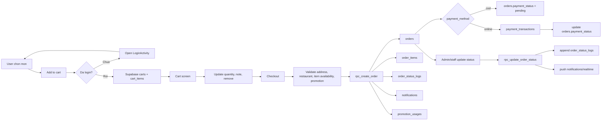
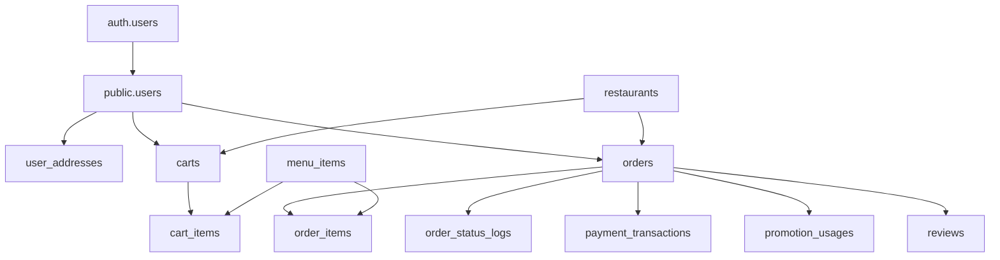

# Cart to Order Checkout Flow

## 1. Overview

Tai lieu nay mo ta luong nghiep vu chinh cua app dat do an:

1. User chon mon
2. Add vao cart
3. Xem va sua cart
4. Checkout
5. Tao order
6. Theo doi order status
7. Xu ly payment neu co

Tai lieu nay bo sung cho [order-client-admin-sync.md](/abs/path/C:/UTT/AppFood/FoodCouriers-Client/docs/technical_design/order-client-admin-sync.md:1) bang cach mo ta ro phan truoc checkout, ownership cua du lieu theo user, va cach noi client Android vao schema Supabase hien co.

Phien ban nay chot rule don gian cho MVP:

- User chua login: khong duoc add vao cart
- User da login: moi duoc add vao cart va checkout

## 2. Source Of Truth

### 2.1 Hien trang code client

Hien tai `FoodCouriers-Client` dang dung cart local trong app:

- [CartRepository.java](/abs/path/C:/UTT/AppFood/FoodCouriers-Client/app/src/main/java/com/utt/foodcouriers_client/data/repository/CartRepository.java:12)
- [CartViewModel.java](/abs/path/C:/UTT/AppFood/FoodCouriers-Client/app/src/main/java/com/utt/foodcouriers_client/viewmodel/CartViewModel.java:14)
- [CartFragment.java](/abs/path/C:/UTT/AppFood/FoodCouriers-Client/app/src/main/java/com/utt/foodcouriers_client/ui/cart/CartFragment.java:24)

Cart nay chua ghi vao Supabase va chua duoc dong bo theo user.

### 2.2 Hien trang schema Supabase

Project Supabase dang dung: `xgpmxfujvjgebtohujgk`.

Schema va RLS da co san cho server-side cart va checkout:

- `carts`
- `cart_items`
- `orders`
- `order_items`
- `order_status_logs`
- `payment_transactions`

Xem schema tai:

- [001_initial_schema.sql](/abs/path/C:/UTT/AppFood/FoodCouriers-Client/docs/supabase/migrations/001_initial_schema.sql:155)
- [002_rpc_functions.sql](/abs/path/C:/UTT/AppFood/FoodCouriers-Client/docs/supabase/migrations/002_rpc_functions.sql:8)
- [003_rls_policies.sql](/abs/path/C:/UTT/AppFood/FoodCouriers-Client/docs/supabase/migrations/003_rls_policies.sql:261)

### 2.3 Ket luan

- Cart phai thuoc ve tung user.
- User phai login truoc khi add cart.
- Order luon la source of truth sau khi user dat hang thanh cong.

## 3. Business Rule Cot Loi

### 3.1 Cart phai gan theo user

Trong schema hien tai:

- `carts.user_id` la `UNIQUE`
- `carts.restaurant_id` la bat buoc

Dieu nay co nghia:

- Moi user chi co 1 cart active tai 1 thoi diem
- Cart do thuoc 1 restaurant cu the

He qua nghiep vu:

1. User dang co cart cua nha hang A
2. User add mon tu nha hang B
3. App phai hoi user:
   - xoa cart cu de chuyen sang nha hang moi
   - hoac huy hanh dong

Khong nen am tham tron mon tu nhieu nha hang vao cung 1 cart trong food delivery app.

### 3.2 Login la dieu kien de dung cart

Rule de xuat cho MVP:

1. User bam `Add to cart` khi chua login
2. App dieu huong sang `LoginActivity`
3. Login thanh cong thi quay lai man truoc do
4. User bam lai `Add to cart`

Khong can support:

- guest cart
- local cart tam thoi truoc login
- merge cart guest vao cart server sau login

### 3.3 Cart la du lieu tam thoi

`carts` va `cart_items` duoc dung de:

- hien thi gio hang hien tai
- cho phep user sua so luong, note, xoa mon
- support sync giua nhieu thiet bi khi da dang nhap

Cart khong phai du lieu lich su.

### 3.4 Order la snapshot chinh thuc

Khi checkout:

- khong doi ten cart thanh order
- khong tiep tuc sua cart item da dat

Thay vao do:

1. Tao `orders`
2. Copy snapshot sang `order_items`
3. Ghi `order_status_logs`
4. Neu thanh cong thi clear cart

Ly do:

- gia mon an co the thay doi sau nay
- ten mon co the doi
- mon an co the bi xoa khoi `menu_items`

`order_items` phai giu snapshot cua:

- `menu_item_name`
- `menu_item_price`
- `quantity`
- `subtotal`
- `note`

## 4. End-To-End Flow



## 5. Data Model Mapping

### 5.1 Bang `carts`

Muc dich:

- dai dien cho gio hang active cua 1 user
- khoa nghiep vu theo `restaurant_id`

Cot chinh:

- `id`
- `user_id`
- `restaurant_id`
- `updated_at`

Rule:

- 1 user = 1 cart active
- 1 cart = 1 restaurant

### 5.2 Bang `cart_items`

Muc dich:

- luu tung mon trong gio

Cot chinh:

- `cart_id`
- `menu_item_id`
- `quantity`
- `note`

Rule hien tai:

- `UNIQUE(cart_id, menu_item_id)`

Tac dong:

- cung 1 mon nhung note khac nhau van bi gop chung

Neu can support note khac nhau thanh nhieu dong rieng, can thay doi schema. De xuat:

1. `UNIQUE(cart_id, menu_item_id, note)`
2. Hoac them `variant_key` roi unique theo `cart_id, menu_item_id, variant_key`

### 5.3 Bang `orders`

Muc dich:

- header cua don hang
- du lieu de list history, tracking, admin processing

Cot chinh:

- `order_code`
- `user_id`
- `restaurant_id`
- `delivery_address`
- `subtotal`
- `delivery_fee`
- `discount`
- `total`
- `payment_method`
- `payment_status`
- `status`

### 5.4 Bang `order_items`

Muc dich:

- snapshot mon an luc checkout

Cot chinh:

- `order_id`
- `menu_item_id`
- `menu_item_name`
- `menu_item_price`
- `quantity`
- `subtotal`
- `note`

### 5.5 Bang `order_status_logs`

Muc dich:

- luu lich su state transition

Cot chinh:

- `order_id`
- `old_status`
- `new_status`
- `changed_by`
- `note`
- `created_at`

Khong nen day timeline vao 1 cot JSON trong `orders` vi:

- kho query
- kho debug
- kho audit

### 5.6 Bang `payment_transactions`

Muc dich:

- log giao dich voi payment provider

Cot chinh:

- `order_id`
- `provider`
- `external_txn_id`
- `amount`
- `status`
- `raw_response`

Bang nay phu hop cho:

- online payment
- webhook reconciliation
- retry / refund tracking

COD co the khong can row o bang nay trong MVP.

## 6. RPC Flow

### 6.1 `rpc_create_order`

Hien co trong:

- [002_rpc_functions.sql](/abs/path/C:/UTT/AppFood/FoodCouriers-Client/docs/supabase/migrations/002_rpc_functions.sql:8)

Luong xu ly:

1. Validate restaurant active/open
2. Validate item availability
3. Tinh subtotal
4. Validate promotion va tinh discount
5. Tinh total
6. Tao `orders`
7. Tao `order_items`
8. Ghi `order_status_logs` voi status `pending`
9. Tao `notifications`
10. Tang `promotion.usage_count` neu co

Luu y:

- RPC hien tai nhan `p_items JSONB`
- RPC hien tai khong tu doc `carts/cart_items`

Dieu nay co nghia la app co 2 cach checkout hop le:

1. Client doc cart roi gui snapshot `items` vao RPC
2. Viet them RPC moi `rpc_checkout_cart(p_user_id, ...)` de server tu doc cart

### 6.2 `rpc_update_order_status`

Hien co trong:

- [002_rpc_functions.sql](/abs/path/C:/UTT/AppFood/FoodCouriers-Client/docs/supabase/migrations/002_rpc_functions.sql:167)

Luong xu ly:

1. Lay current status
2. Validate transition
3. Update `orders.status`
4. Append `order_status_logs`
5. Tao notification cho customer

## 7. Ownership Va RLS

RLS hien tai da theo dung huong business:

- user chi doc/sua cart cua minh
- user chi doc order cua minh
- admin moi update order toan he thong

Tham chieu:

- [003_rls_policies.sql](/abs/path/C:/UTT/AppFood/FoodCouriers-Client/docs/supabase/migrations/003_rls_policies.sql:123)
- [003_rls_policies.sql](/abs/path/C:/UTT/AppFood/FoodCouriers-Client/docs/supabase/migrations/003_rls_policies.sql:261)
- [003_rls_policies.sql](/abs/path/C:/UTT/AppFood/FoodCouriers-Client/docs/supabase/migrations/003_rls_policies.sql:290)

Mapping ownership:

| Entity | Owner | Editable By | Notes |
|---|---|---|---|
| `carts` | customer | customer | 1 cart active / user |
| `cart_items` | customer | customer | editable truoc checkout |
| `orders` | customer | admin/staff update status | customer chi create/read |
| `order_items` | order owner | khong sua sau checkout | snapshot |
| `order_status_logs` | order owner | system/admin append | audit trail |
| `payment_transactions` | order owner | system/payment service | read-only voi customer |

## 8. Recommended Client Architecture

### 8.1 Single cart mode cho user da login

De don gian hoa implementation, MVP chi support 1 mode:

1. Chua login:
   - khong duoc add cart
   - khong mo duoc cart/checkout
2. Da login:
   - toan bo cart doc/ghi tren Supabase

### 8.2 Repository de xuat

Khong can `CartLocalRepository`.

Chi can:

1. `CartRemoteRepository`
2. `CartViewModel`

`CartRemoteRepository` la source of truth cho:

- `getOrCreateCart`
- `getCart`
- `addToCart`
- `updateCartItemQuantity`
- `removeCartItem`
- `clearCart`

## 9. Use Cases Can Implement

### 9.1 Add To Cart

Flow:

1. Kiem tra current user da login chua
2. Neu chua login:
   - open `LoginActivity`
   - dung flow add cart
3. Neu da login:
   - map `auth.uid()` sang `public.users.id`
   - get or create `carts`
   - validate `restaurant_id`
   - upsert `cart_items`

Pseudo-flow:

```text
addToCart(menuItem, restaurant, qty, note)
-> if not logged in:
   -> openLogin()
   -> return
-> cart = findCartByUser(userId)
-> if no cart: createCart(userId, restaurantId)
-> if cart.restaurant_id != restaurantId:
   -> ask user replace existing cart?
-> upsert cart_items
-> fetch cart summary
```

### 9.2 Get Cart

Flow:

1. Tim cart cua user
2. Join sang `cart_items`
3. Join sang `menu_items` de lay ten, gia, image
4. Tinh summary

Nen tra ve DTO:

- restaurant info
- line items
- subtotal
- delivery fee
- discount
- total

### 9.3 Checkout From Cart

Flow de xuat:

1. Client lay snapshot cart hien tai
2. Client goi `rpc_create_order(...)`
3. Neu success:
   - xoa `cart_items`
   - xoa hoac reset `carts`
4. Dieu huong sang `OrderSuccessActivity`

Phien ban tot hon:

- viet them `rpc_checkout_cart(...)`
- server tu doc cart, tao order, clear cart trong cung transaction

Khi do tranh duoc race condition:

- user doi quantity o 2 thiet bi
- item het hang giua luc client fetch cart va checkout

## 10. Gap Giua Schema Va Client Hien Tai

### 10.1 Gap 1: Cart dang local-only

Client dang chua goi `carts/cart_items`, nen:

- chua gan chat voi user
- chua sync da thiet bi
- chua enforce rule phai login truoc khi add cart

### 10.2 Gap 2: Checkout chua dung RPC that

Client chua noi voi `rpc_create_order`, nen:

- chua tao `orders`
- chua tao `order_items`
- chua co status logs that

### 10.3 Gap 3: Status enum co the lech schema

DB that co `ready_for_pickup` trong `orders.status`, can doi chieu lai:

- app client
- app admin
- enum Java/Kotlin
- UI timeline

### 10.4 Gap 4: `cart_items` unique chua cover note variants

Neu business muon 1 mon co nhieu note khac nhau, can doi schema truoc khi implement remote cart chinh thuc.

## 11. Implementation Recommendation

### Phase 1: Lam ro nghiep vu

1. Chot rule:
   - 1 user chi co 1 cart?
   - 1 cart chi thuoc 1 restaurant?
   - user chua login co bi chan add cart khong?
   - note khac nhau co tach dong khong?

### Phase 2: Noi remote cart

1. Tao `CartRemoteRepository`
2. Implement:
   - `getOrCreateCart`
   - `getCart`
   - `addToCart`
   - `updateCartItemQuantity`
   - `removeCartItem`
   - `clearCart`
3. Chan `Add to cart` neu user chua login
4. Dieu huong sang login roi quay lai man truoc

### Phase 3: Noi checkout that

1. Client lay cart snapshot
2. Call `rpc_create_order`
3. Clear cart neu success
4. Open `OrderSuccessActivity`

### Phase 4: Realtime tracking

1. Subscribe `orders` theo `order_id`
2. Optional subscribe `order_status_logs`
3. Update `OrdersFragment` va `OrderTrackingActivity`

### Phase 5: Online payment

1. Tao provider integration
2. Ghi `payment_transactions`
3. Update `orders.payment_status`
4. Xu ly webhook retry / reconciliation

## 12. Concrete Recommendation For This Repo

De repo de hieu va de code tiep, nen di theo thu tu nay:

1. Bo guest cart khoi pham vi MVP
2. Chan `Add to cart` khi user chua login
3. Khi da login, tao remote cart theo `public.users.id`
4. Doi `CartFragment` sang remote data tu Supabase
5. Noi `CheckoutActivity` vao `rpc_create_order`
6. Sau checkout success thi clear cart
7. Noi `OrdersFragment` va `OrderTrackingActivity` vao data that tu Supabase

## 13. Appendix: Simplified Entity Graph


