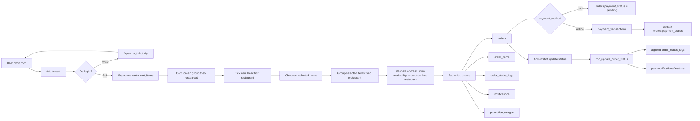
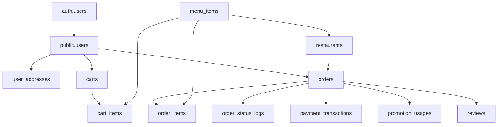

# Cart to Order Checkout Flow

## 1. Overview

Tai lieu nay mo ta luong nghiep vu chinh cua app dat do an:

1. User chon mon
2. Add vao cart
3. Xem va sua cart
4. Checkout
5. Tao order
6. Theo doi order status
7. Xu ly payment neu co

Tai lieu nay bo sung cho [order-client-admin-sync.md](/abs/path/C:/UTT/AppFood/FoodCouriers-Client/docs/technical_design/order-client-admin-sync.md:1) bang cach mo ta ro phan truoc checkout, ownership cua du lieu theo user, va cach noi client Android vao schema Supabase hien co.

Phien ban nay chot rule cho MVP va huong mo rong:

- User chua login: khong duoc add vao cart
- User da login: moi duoc add vao cart va checkout
- Moi user co 1 `cart` chung
- `cart_items` co the thuoc nhieu restaurant khac nhau
- Man cart se group item theo restaurant
- Khi checkout, he thong tach item da chon thanh nhieu `orders`, moi `order` thuoc 1 restaurant

## 2. Source Of Truth

### 2.1 Hien trang code client

Hien tai `FoodCouriers-Client` dang dung cart local trong app:

- [CartRepository.java](/abs/path/C:/UTT/AppFood/FoodCouriers-Client/app/src/main/java/com/utt/foodcouriers_client/data/repository/CartRepository.java:12)
- [CartViewModel.java](/abs/path/C:/UTT/AppFood/FoodCouriers-Client/app/src/main/java/com/utt/foodcouriers_client/viewmodel/CartViewModel.java:14)
- [CartFragment.java](/abs/path/C:/UTT/AppFood/FoodCouriers-Client/app/src/main/java/com/utt/foodcouriers_client/ui/cart/CartFragment.java:24)

Cart nay chua ghi vao Supabase va chua duoc dong bo theo user.

### 2.2 Hien trang schema Supabase

Project Supabase dang dung: `xgpmxfujvjgebtohujgk`.

Schema va RLS da co san cho server-side cart va checkout:

- `carts`
- `cart_items`
- `orders`
- `order_items`
- `order_status_logs`
- `payment_transactions`

Xem schema tai:

- [001_initial_schema.sql](/abs/path/C:/UTT/AppFood/FoodCouriers-Client/docs/supabase/migrations/001_initial_schema.sql:155)
- [002_rpc_functions.sql](/abs/path/C:/UTT/AppFood/FoodCouriers-Client/docs/supabase/migrations/002_rpc_functions.sql:8)
- [003_rls_policies.sql](/abs/path/C:/UTT/AppFood/FoodCouriers-Client/docs/supabase/migrations/003_rls_policies.sql:261)

### 2.3 Ket luan

- Cart phai thuoc ve tung user.
- User phai login truoc khi add cart.
- Cart khong can phu thuoc truc tiep vao restaurant.
- Order luon la source of truth sau khi user dat hang thanh cong.

## 3. Business Rule Cot Loi

### 3.1 Cart phai gan theo user

Cart van phai gan theo user, nhung khong can khoa theo restaurant.

Rule de xuat:

- `carts` chi dai dien cho gio hang active cua user
- `cart_items` luu cac mon duoc them vao gio
- restaurant cua moi item duoc xac dinh thong qua `menu_items.restaurant_id`

He qua nghiep vu:

1. User co the add mon tu nha hang A
2. Sau do add them mon tu nha hang B
3. Cart khong bi clear
4. UI cart se group item theo restaurant
5. Khi checkout, he thong tao nhieu order rieng theo restaurant

Day la huong phu hop hon neu muon UX mem va khong ep user xoa gio cu.

### 3.2 Login la dieu kien de dung cart

Rule de xuat cho MVP:

1. User bam `Add to cart` khi chua login
2. App dieu huong sang `LoginActivity`
3. Login thanh cong thi quay lai man truoc do
4. User bam lai `Add to cart`

Khong can support:

- guest cart
- local cart tam thoi truoc login
- merge cart guest vao cart server sau login

### 3.3 Cart la du lieu tam thoi

`carts` va `cart_items` duoc dung de:

- hien thi gio hang hien tai
- cho phep user sua so luong, note, xoa mon
- support sync giua nhieu thiet bi khi da dang nhap

Cart khong phai du lieu lich su.

### 3.4 Order la snapshot chinh thuc

Khi checkout:

- khong doi ten cart thanh order
- khong tiep tuc sua cart item da dat

Thay vao do:

1. Gom cac `cart_items` da chon theo restaurant
2. Tao nhieu `orders`
3. Copy snapshot sang `order_items`
4. Ghi `order_status_logs`
5. Neu thanh cong thi xoa cac `cart_items` da checkout

Ly do:

- gia mon an co the thay doi sau nay
- ten mon co the doi
- mon an co the bi xoa khoi `menu_items`

`order_items` phai giu snapshot cua:

- `menu_item_name`
- `menu_item_price`
- `quantity`
- `subtotal`
- `note`

## 4. End-To-End Flow



## 5. Data Model Mapping

### 5.1 Bang `carts`

Muc dich:

- dai dien cho gio hang active cua 1 user

Cot chinh:

- `id`
- `user_id`
- `updated_at`

Rule:

- 1 user = 1 cart active
- cart co the chua item tu nhieu restaurant

### 5.2 Bang `cart_items`

Muc dich:

- luu tung mon trong gio

Cot chinh:

- `cart_id`
- `menu_item_id`
- `quantity`
- `note`

Rule hien tai:

- `UNIQUE(cart_id, menu_item_id)`
- restaurant cua item duoc suy ra tu `menu_items.restaurant_id`

Tac dong:

- cung 1 mon nhung note khac nhau van bi gop chung

Neu can support note khac nhau thanh nhieu dong rieng, can thay doi schema. De xuat:

1. `UNIQUE(cart_id, menu_item_id, note)`
2. Hoac them `variant_key` roi unique theo `cart_id, menu_item_id, variant_key`

### 5.3 Bang `orders`

Muc dich:

- header cua don hang
- du lieu de list history, tracking, admin processing

Cot chinh:

- `order_code`
- `user_id`
- `restaurant_id`
- `delivery_address`
- `subtotal`
- `delivery_fee`
- `discount`
- `total`
- `payment_method`
- `payment_status`
- `status`

Rule:

- 1 order chi thuoc 1 restaurant
- neu user checkout item tu 2 restaurant, he thong tao 2 order

### 5.4 Bang `order_items`

Muc dich:

- snapshot mon an luc checkout

Cot chinh:

- `order_id`
- `menu_item_id`
- `menu_item_name`
- `menu_item_price`
- `quantity`
- `subtotal`
- `note`

### 5.5 Bang `order_status_logs`

Muc dich:

- luu lich su state transition

Cot chinh:

- `order_id`
- `old_status`
- `new_status`
- `changed_by`
- `note`
- `created_at`

Khong nen day timeline vao 1 cot JSON trong `orders` vi:

- kho query
- kho debug
- kho audit

### 5.6 Bang `payment_transactions`

Muc dich:

- log giao dich voi payment provider

Cot chinh:

- `order_id`
- `provider`
- `external_txn_id`
- `amount`
- `status`
- `raw_response`

Bang nay phu hop cho:

- online payment
- webhook reconciliation
- retry / refund tracking

COD co the khong can row o bang nay trong MVP.

## 6. RPC Flow

### 6.1 `rpc_create_order`

Hien co trong:

- [002_rpc_functions.sql](/abs/path/C:/UTT/AppFood/FoodCouriers-Client/docs/supabase/migrations/002_rpc_functions.sql:8)

Luong xu ly:

1. Validate restaurant active/open
2. Validate item availability
3. Tinh subtotal
4. Validate promotion va tinh discount
5. Tinh total
6. Tao `orders`
7. Tao `order_items`
8. Ghi `order_status_logs` voi status `pending`
9. Tao `notifications`
10. Tang `promotion.usage_count` neu co

Luu y:

- RPC hien tai nhan `p_items JSONB`
- RPC hien tai khong tu doc `carts/cart_items`

Dieu nay co nghia la app co 2 cach checkout hop le:

1. Client group selected `cart_items` theo restaurant roi goi `rpc_create_order(...)` nhieu lan
2. Viet them RPC moi `rpc_checkout_selected_cart_items(p_user_id, p_cart_item_ids, ...)` de server tu nhom theo restaurant va tao nhieu order

De xuat:

- MVP: client group va goi RPC nhieu lan
- phase sau: dua grouping logic vao 1 RPC de tranh race condition

### 6.2 `rpc_update_order_status`

Hien co trong:

- [002_rpc_functions.sql](/abs/path/C:/UTT/AppFood/FoodCouriers-Client/docs/supabase/migrations/002_rpc_functions.sql:167)

Luong xu ly:

1. Lay current status
2. Validate transition
3. Update `orders.status`
4. Append `order_status_logs`
5. Tao notification cho customer

## 7. Ownership Va RLS

RLS hien tai da theo dung huong business:

- user chi doc/sua cart cua minh
- user chi doc order cua minh
- admin moi update order toan he thong

Tham chieu:

- [003_rls_policies.sql](/abs/path/C:/UTT/AppFood/FoodCouriers-Client/docs/supabase/migrations/003_rls_policies.sql:123)
- [003_rls_policies.sql](/abs/path/C:/UTT/AppFood/FoodCouriers-Client/docs/supabase/migrations/003_rls_policies.sql:261)
- [003_rls_policies.sql](/abs/path/C:/UTT/AppFood/FoodCouriers-Client/docs/supabase/migrations/003_rls_policies.sql:290)

Mapping ownership:

| Entity | Owner | Editable By | Notes |
|---|---|---|---|
| `carts` | customer | customer | 1 cart active / user |
| `cart_items` | customer | customer | co the thuoc nhieu restaurant |
| `orders` | customer | admin/staff update status | 1 order / 1 restaurant |
| `order_items` | order owner | khong sua sau checkout | snapshot |
| `order_status_logs` | order owner | system/admin append | audit trail |
| `payment_transactions` | order owner | system/payment service | read-only voi customer |

## 8. Recommended Client Architecture

### 8.1 Single user cart, grouped by restaurant

De don gian hoa implementation, MVP support 1 mode:

1. Chua login:
   - khong duoc add cart
   - khong mo duoc cart/checkout
2. Da login:
   - user co 1 cart tren Supabase
   - trong cart co the co item tu nhieu restaurant
   - UI group item theo restaurant
   - user tick item hoac tick ca restaurant de checkout

### 8.2 Repository de xuat

Khong can `CartLocalRepository`.

Chi can:

1. `CartRemoteRepository`
2. `CartViewModel`

`CartRemoteRepository` la source of truth cho:

- `getOrCreateCart`
- `getCart`
- `addToCart`
- `updateCartItemQuantity`
- `removeCartItem`
- `clearCart`
- `checkoutSelectedItems`

## 9. Use Cases Can Implement

### 9.1 Add To Cart

Flow:

1. Kiem tra current user da login chua
2. Neu chua login:
   - open `LoginActivity`
   - dung flow add cart
3. Neu da login:
   - map `auth.uid()` sang `public.users.id`
   - get or create `carts`
   - upsert `cart_items`

Pseudo-flow:

```text
addToCart(menuItem, restaurant, qty, note)
-> if not logged in:
   -> openLogin()
   -> return
-> cart = findCartByUser(userId)
-> if no cart: createCart(userId)
-> upsert cart_items
-> fetch cart summary
```

### 9.2 Get Cart

Flow:

1. Tim cart cua user
2. Join sang `cart_items`
3. Join sang `menu_items`
4. Join sang `restaurants`
5. Group item theo `restaurant_id`
6. Tinh summary cho tung group
7. Tinh summary tong cho cac item dang duoc chọn o UI

Nen tra ve DTO:

- list `restaurantGroups`
- trong moi group:
  - `restaurantId`
  - `restaurantName`
  - `items`
  - `subtotal`
  - `deliveryFee`
  - `discount`
  - `total`

### 9.3 Checkout Selected Items

Flow de xuat:

1. User tick item hoac tick restaurant trong man cart
2. Client lay danh sach `selected_cart_item_ids`
3. Client group selected item theo `restaurant_id`
4. Voi moi restaurant group:
   - tinh payload `items`
   - goi `rpc_create_order(...)`
5. Neu tat ca success:
   - xoa cac `cart_items` da duoc checkout
6. Dieu huong sang man thanh cong / danh sach order

Phien ban tot hon:

- viet them `rpc_checkout_selected_cart_items(...)`
- server tu:
  - doc selected item
  - group theo restaurant
  - tao nhieu order
  - clear selected cart items
  - tra ve danh sach `order_ids`

Khi do tranh duoc race condition:

- user doi quantity o 2 thiet bi
- item het hang giua luc client fetch cart va checkout

## 10. Gap Giua Schema Va Client Hien Tai

### 10.1 Gap 1: Cart dang local-only

Client dang chua goi `carts/cart_items`, nen:

- chua gan chat voi user
- chua sync da thiet bi
- chua enforce rule phai login truoc khi add cart
- chua group cart theo restaurant

### 10.2 Gap 2: Checkout chua dung RPC that

Client chua noi voi `rpc_create_order`, nen:

- chua tao `orders`
- chua tao `order_items`
- chua co status logs that

### 10.3 Gap 3: Status enum co the lech schema

DB that co `ready_for_pickup` trong `orders.status`, can doi chieu lai:

- app client
- app admin
- enum Java/Kotlin
- UI timeline

### 10.4 Gap 4: `cart_items` unique chua cover note variants

Neu business muon 1 mon co nhieu note khac nhau, can doi schema truoc khi implement remote cart chinh thuc.

## 11. Implementation Recommendation

### Phase 1: Lam ro nghiep vu

1. Chot rule:
   - 1 user chi co 1 cart?
   - cart co cho phep item tu nhieu restaurant khong?
   - user chua login co bi chan add cart khong?
   - note khac nhau co tach dong khong?
   - checkout theo item hay theo restaurant group?

### Phase 2: Noi remote cart

1. Tao `CartRemoteRepository`
2. Implement:
   - `getOrCreateCart`
   - `getCart`
   - `addToCart`
   - `updateCartItemQuantity`
   - `removeCartItem`
   - `clearCart`
   - `getSelectedCheckoutPreview`
3. Chan `Add to cart` neu user chua login
4. Dieu huong sang login roi quay lai man truoc
5. Group item theo restaurant trong `CartFragment`
6. Them checkbox cho item va restaurant group

### Phase 3: Noi checkout that

1. Client lay `selected_cart_item_ids`
2. Group theo restaurant
3. Call `rpc_create_order` cho moi restaurant group
4. Clear cac cart item da checkout neu success
5. Open `OrderSuccessActivity` hoac man tong hop ket qua

### Phase 4: Realtime tracking

1. Subscribe `orders` theo `order_id`
2. Optional subscribe `order_status_logs`
3. Update `OrdersFragment` va `OrderTrackingActivity`

### Phase 5: Online payment

1. Tao provider integration
2. Ghi `payment_transactions`
3. Update `orders.payment_status`
4. Xu ly webhook retry / reconciliation

## 12. Concrete Recommendation For This Repo

De repo de hieu va de code tiep, nen di theo thu tu nay:

1. Bo guest cart khoi pham vi MVP
2. Chan `Add to cart` khi user chua login
3. Khi da login, tao remote cart theo `public.users.id`
4. Bo `restaurant_id` khoi `carts` trong schema moi
5. Doi `CartFragment` sang remote data va group theo restaurant
6. Them checkbox item / restaurant group
7. Noi `CheckoutActivity` vao flow `selected_cart_item_ids -> multiple orders`
8. Sau checkout success thi clear cac item da checkout
9. Noi `OrdersFragment` va `OrderTrackingActivity` vao data that tu Supabase

## 13. Appendix: Simplified Entity Graph


